**SENG 438 - Software Testing, Reliability, and Quality**

**Lab. Report #3 – Code Coverage, Adequacy Criteria and Test Case Correlation**

| Group: 11      |
|-----------------|
| Jam Ivy Gammuac                |   
| Thomas Kusinski              |   
| Austin Lee               |   
| Shanelle Li Chit Khim                |  

(Note that some labs require individual reports while others require one report
for each group. Please see each lab document for details.)

# 1 Introduction

This lab was conducted to give a stronger insight on white box testing. Through the analysis of the provided source code and documentation, we improved our test suite from the previous assignment to increase code coverage. With the assistance of the coverage tool EclEmma we created test cases to measure 3 forms of coverage: statement coverage, branch coverage, and method coverage.

# 2 Manual data-flow coverage calculations for X and Y methods
## For DataUtilities.calculateColumnTotal:
### Data Flow Graph:
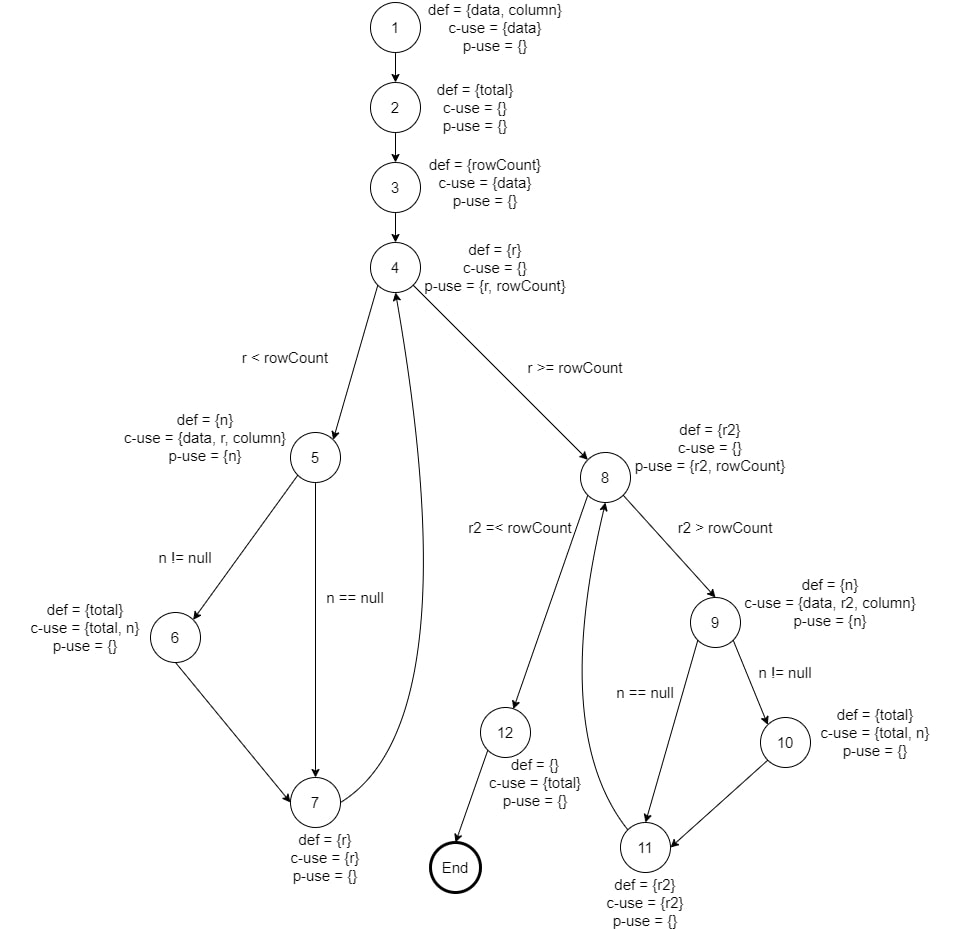

### Def-Use per Statement:
| Statement | Def | Use |
| --- | --- | --- |
| public static double calculateColumnTotal(Values2D data, int column) | data, column | none |
| ParamChecks.nullNotPermitted(data, "data"); | none | data |
| double total = 0.0; | total | none |
| int rowCount = data.getRowCount(); | rowCount | data |
| for (int r = 0; r \< rowCount; r++) | r | r, rowCount |
| Number n = data.getValue(r, column); | n | data, r, column |
| if (n != null) | none | n |
| total += n.doubleValue(); | total | total, n |
| for (int r2 = 0; r2 > rowCount; r2++) | r2 | r2, rowCount |
| Number n = data.getValue(r2, column); | n | data, r2, column |
| if (n != null) | none | n |
| total += n.doubleValue(); | total | total, n |
| return total; | none | total |

### DU-Pairs per Variable:
| Variable | DU-Pairs |
| --- | --- |
| data | (1,1), (1,3), (1,5), (1,9) |
| column | (1,5), (1,9) |
| total | (2,6), (2,10), (2,12), (6,6), (10,10), (6,12), (10,12) |
| rowCount | (3,4), (3,8) |
| r | (4,4), (4,5), (4,7), (7,7) |
| n | (5,5), (5,6), (9,9), (9,10) |
| r2 | (8,8), (8,9), (8,11), (11,11) |

### DU-Pairs Covered Per Test Case:
columnTotalCheck1Vals() - (1,1), (1,3), (1,5), (2,6), (2,12), (6,6), (6.12), (3,4), (3,8), (4,4), (4,5), (4,7), (7,7), (5,5), (5,6)

columnTotalCheck2Vals() - (1,1), (1,3), (1,5), (2,6), (2,12), (6,6), (6,12), (3,4), (3,8), (4,4), (4,5), (4,7), (7,7), (5,5), (5,6)

columnTotalCheck4Vals() - (1,1), (1,3), (1,5), (2,6), (2,12), (6,6), (6.12), (3,4), (3,8), (4,4), (4,5), (4,7), (7,7), (5,5), (5,6)

columnTotalCheckNoVals() - (1,1), (1,3), (4,4), (8,8), (2,12)

### DU-Pair Coverage Calculation

---
## For Range.getLowerBound():
### Data Flow Graph:
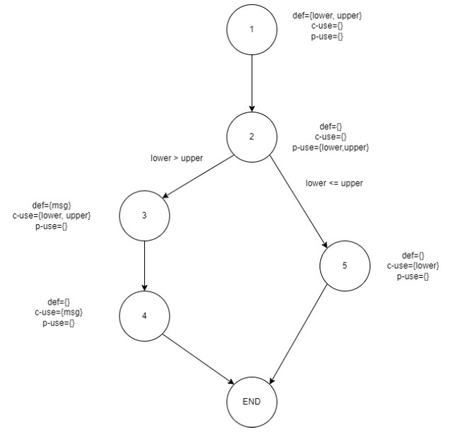

### Def-Use per Statement:
| Statement | Def | Use |
| --- | --- | --- |
| public double getLowerBound(); | lower, upper | none |
| if (lower \> upper) | none | lower, upper |
| String msg = "Range(double, double): requires lower (" + lower + ") \<= upper (" + upper + ")."; | msg | lower, upper |
| throw new IllegalArgumentException(msg); | none | msg |
| return this.lower; | none | lower |

### DU-Pairs per Variable:
| Variable | DU-Pairs |
| --- | --- |
| lower | (1,2), (1,3), (1,5) |
| upper | (1,2), (1,3) |
| msg | (3,4) |

### DU-Pairs Covered Per Test Case:
(These are tests that were reused from assignment2, did not any other tests as the only path that wasn't covered is unfeasible):

getLowerBoundWithNegativeInteger() - (1,2), (1,5)

getLowerBoundWithPositiveInteger() - (1,2), (1,5)

getLowerBoundWithSameRange() - (1,2), (1,5)

getLowerBoundWithZero() - (1,2), (1,5)

getLowerBoundWithDecimalNegative() - (1,2), (1,5)

getLowerBoundWithDecimalPositive() - (1,2), (1,5)

getLowerBoundWithBoth0Bounds() - (1,2), (1,5)

### DU-Pair Coverage Calculation

# 3 A detailed description of the testing strategy for the new unit test

For creating unit tests first we considered what we learned from our black box testing from assignment 2. We knew what the specifications for each function were based on reading the documentation so we created test cases with inputs that were partitioned into several equivalence classes. After running these tests we checked the line, branch and method coverage percentages. Then we examined the source code and created new test cases for lines, branches, or methods that were missed and could be accessed from each function in order to increase code coverage.

# 4 A high level description of five selected test cases you have designed using coverage information, and how they have increased code coverage

Text…

# 5 A detailed report of the coverage achieved of each class and method (a screen shot from the code cover results in green and red color would suffice)

## For Range Class
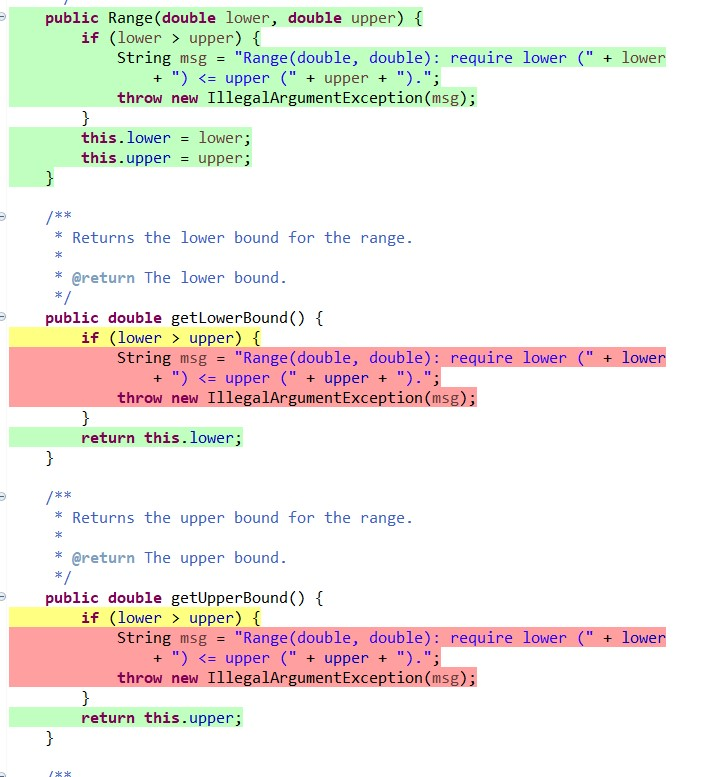
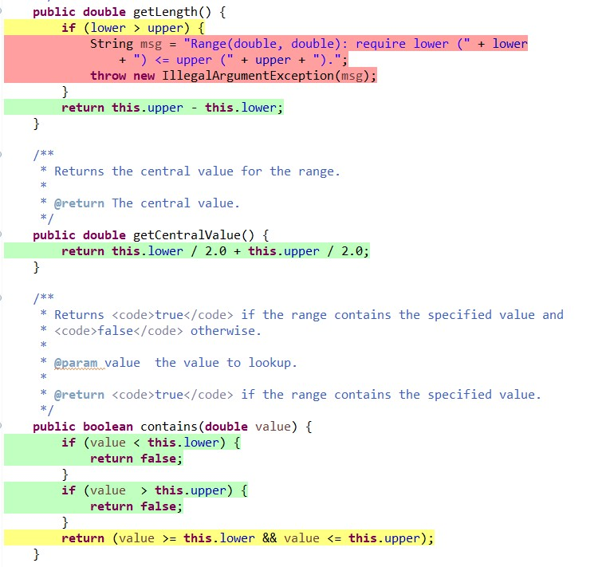
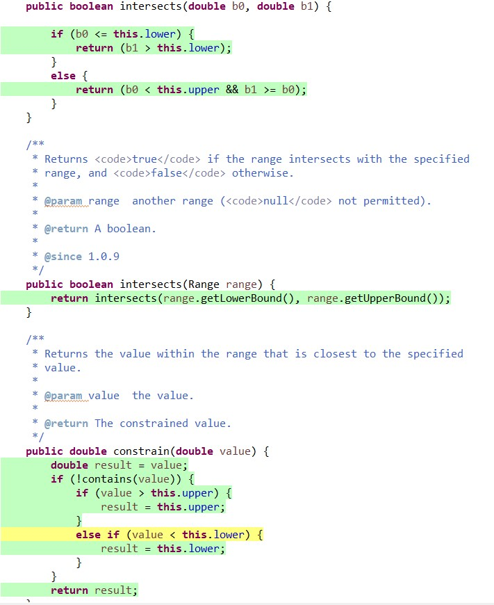
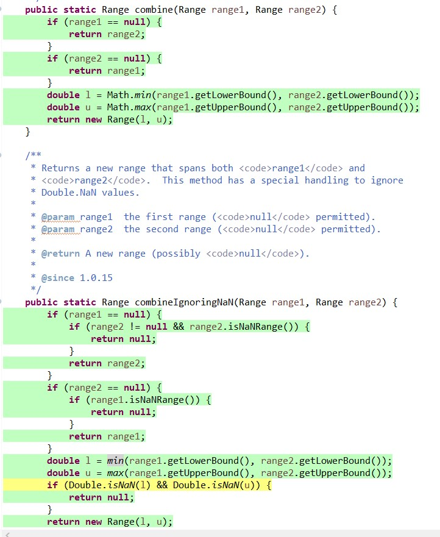
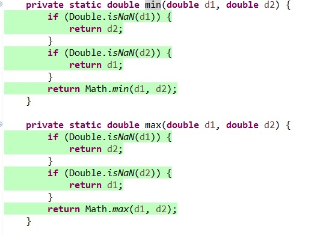
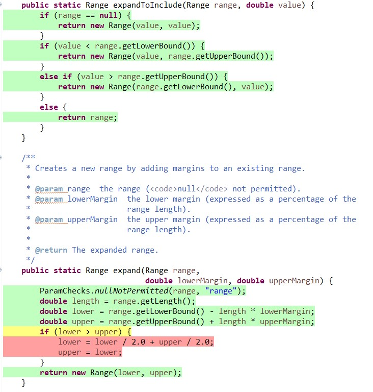
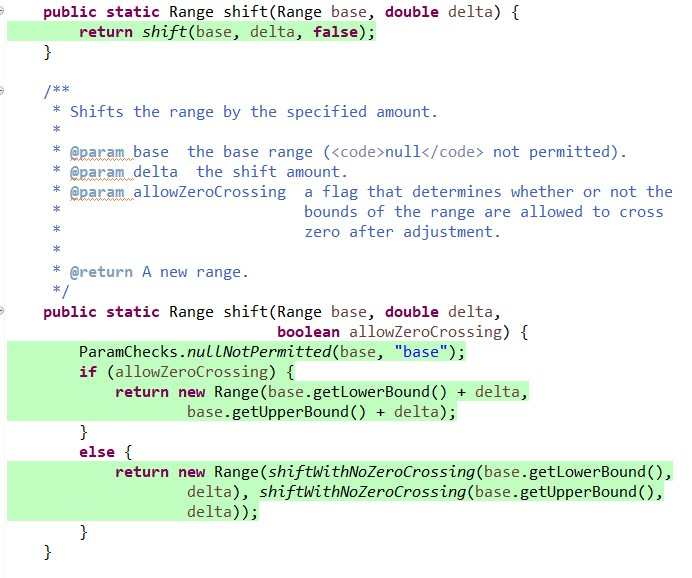
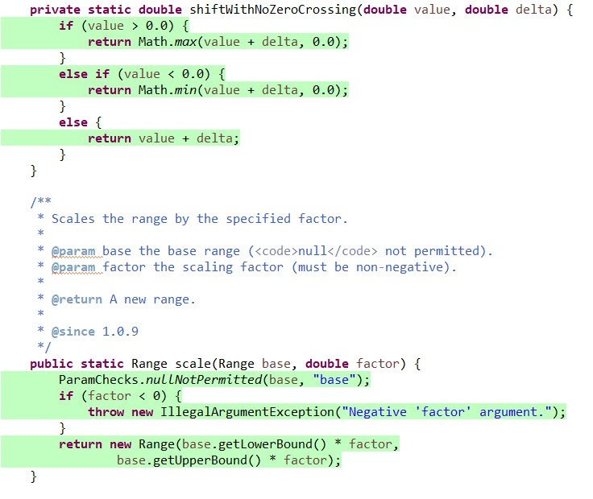
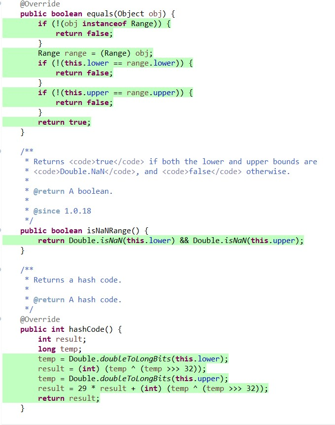
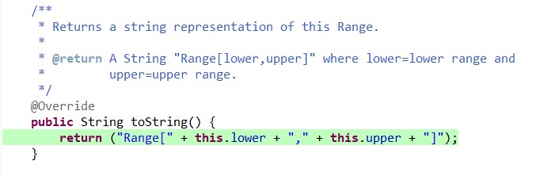

## For DataUtilities Class
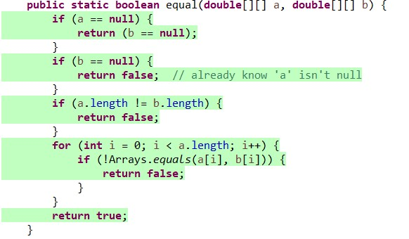
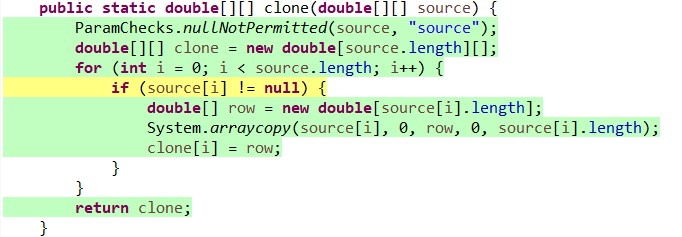
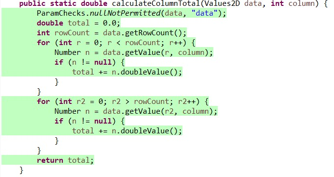
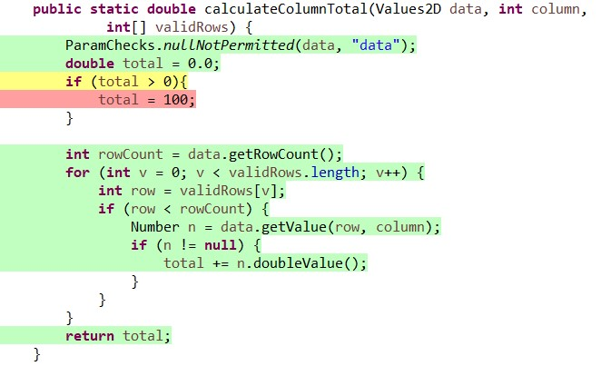
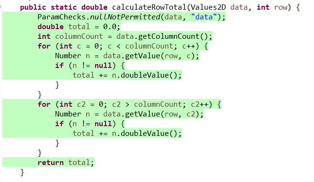

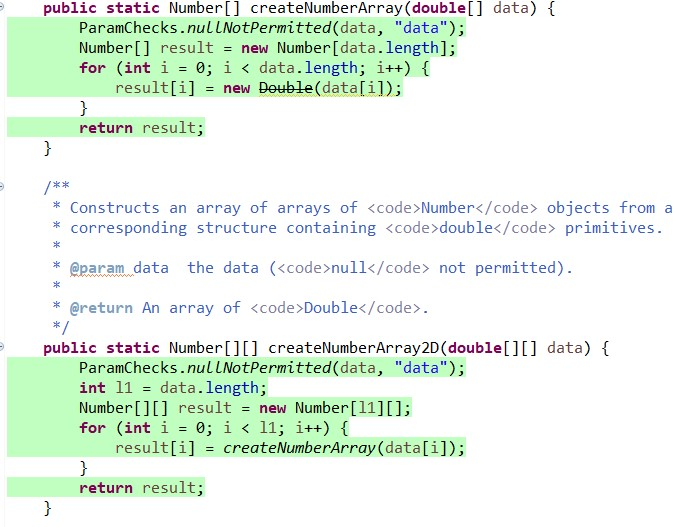
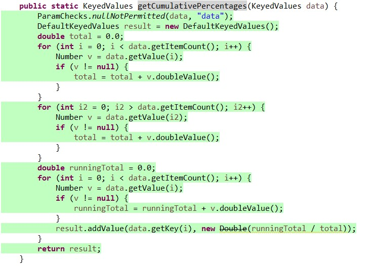

# 6 Pros and Cons of coverage tools used and Metrics you report

Text…

# 7 A comparison on the advantages and disadvantages of requirements-based test generation and coverage-based test generation.

Text…

# 8 A discussion on how the team work/effort was divided and managed

Text…

# 9 Any difficulties encountered, challenges overcome, and lessons learned from performing the lab

Text…

# 10 Comments/feedback on the lab itself

Text…
