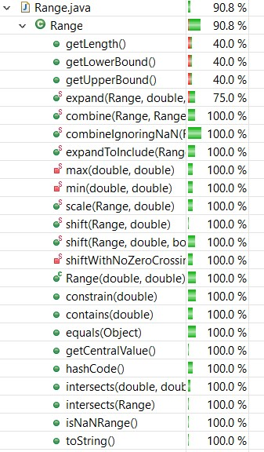
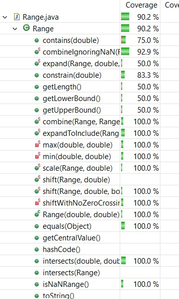
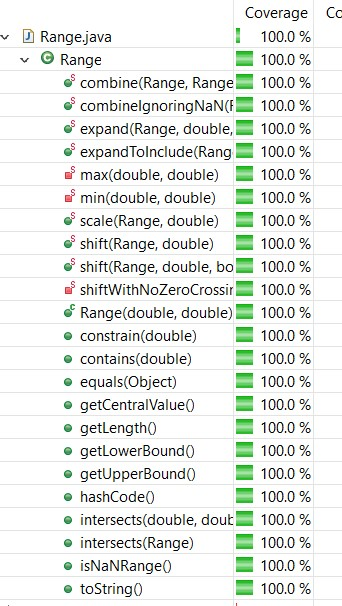
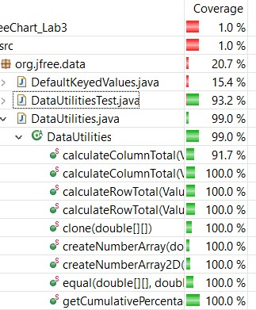
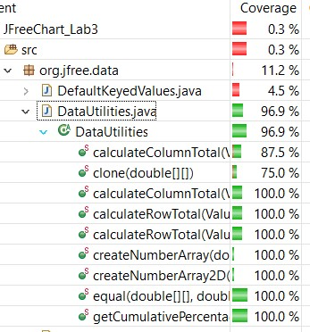
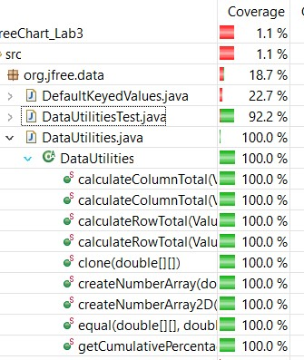

**SENG 438 - Software Testing, Reliability, and Quality**

**Lab. Report #3 – Code Coverage, Adequacy Criteria and Test Case Correlation**

| Group: 11      |
|-----------------|
| Jam Ivy Gammuac                |   
| Thomas Kusinski              |   
| Austin Lee               |   
| Shanelle Li Chit Khim                |  

(Note that some labs require individual reports while others require one report
for each group. Please see each lab document for details.)

# 1 Introduction

This lab was conducted to give a stronger insight on white box testing. Through the analysis of the provided source code and documentation, we improved our test suite from the previous assignment to increase code coverage. With the assistance of the coverage tool EclEmma we created test cases to measure 3 forms of coverage: statement coverage, branch coverage, and method coverage.

# 2 Manual data-flow coverage calculations for X and Y methods
## For DataUtilities.calculateColumnTotal:
### Data Flow Graph:

### Def-Use per Statement:
| Statement | Def | Use |
| --- | --- | --- |
| public static double calculateColumnTotal(Values2D data, int column) | data, column | none |
| ParamChecks.nullNotPermitted(data, "data"); | none | data |
| double total = 0.0; | total | none |
| int rowCount = data.getRowCount(); | rowCount | data |
| for (int r = 0; r \< rowCount; r++) | r | r, rowCount |
| Number n = data.getValue(r, column); | n | data, r, column |
| if (n != null) | none | n |
| total += n.doubleValue(); | total | total, n |
| for (int r2 = 0; r2 > rowCount; r2++) | r2 | r2, rowCount |
| Number n = data.getValue(r2, column); | n | data, r2, column |
| if (n != null) | none | n |
| total += n.doubleValue(); | total | total, n |
| return total; | none | total |

### DU-Pairs per Variable:
| Variable | DU-Pairs |
| --- | --- |
| data | (1,1), (1,3), (1,5), (1,9) |
| column | (1,5), (1,9) |
| total | (2,6), (2,10), (2,12), (6,6), (10,10), (6,12), (10,12) |
| rowCount | (3,4), (3,8) |
| r | (4,4), (4,5), (4,7), (7,7) |
| n | (5,5), (5,6), (9,9), (9,10) |
| r2 | (8,8), (8,9), (8,11), (11,11) |

### DU-Pairs Covered Per Test Case:
| Test Case | DU-Pairs |
| --- | --- |
| columnTotalCheck1Vals() | (1,1, data), (1,3, data), (1,3, column) (1,5, data), (1,5, column), (2,6), (2,12), (6,6), (6.12), (3,4), (3,8), (4,4), (4,5), (4,7), (7,7), (5,5), (5,6) |
| columnTotalCheck2Vals() | (1,1), (1,3), (1,5), (2,6), (2,12), (6,6), (6,12), (3,4), (3,8), (4,4), (4,5), (4,7), (7,7), (5,5), (5,6) |
| columnTotalCheck4Vals() | (1,1), (1,3), (1,5), (2,6), (2,12), (6,6), (6.12), (3,4), (3,8), (4,4), (4,5), (4,7), (7,7), (5,5), (5,6) |
| columnTotalCheckNoVals() | (1,1), (1,3, data), (1,3, column) (4,4), (8,8), (2,12) |

### DU-Pair Coverage Calculation
| Test Case | DU-Pairs Coverage (DU Pairs covered in test case/ total DU Pairs) |
| --- | --- |
| columnTotalCheck1Vals() | 17/27 = 62.96% |
| columnTotalCheck2Vals() | 17/27 = 62.96% |
| columnTotalCheck4Vals() | 17/27 = 62.96% |
| columnTotalCheckNoVals() | 6/27 = 22.22% |

---
## For Range.getLowerBound():
### Data Flow Graph:

### Def-Use per Statement:
| Statement | Def | Use |
| --- | --- | --- |
| public double getLowerBound(); | lower, upper | none |
| if (lower > upper) | none | lower, upper |
| String msg = "Range(double, double): requires lower (" + lower + ") \<= upper (" + upper + ")."; | msg | lower, upper |
| throw new IllegalArgumentException(msg); | none | msg |
| return this.lower; | none | lower |

### DU-Pairs per Variable:
| Variable | DU-Pairs |
| --- | --- |
| lower | (1,2), (1,3), (1,5) |
| upper | (1,2), (1,3) |
| msg | (3,4) |

### DU-Pairs Covered Per Test Case:
(These are all tests that were created in assignment2, we did not create any other tests for getLowerBound() as the only path that wasn't covered is unfeasible. Also tests that tested invalid input not included):

| Test Case | DU-Pairs |
| --- | --- |
| getLowerBoundWithNegativeInteger() | (1,2, lower), (1,2, upper), (1,5, lower) |
| getLowerBoundWithPositiveInteger() | (1,2, lower), (1,2, upper), (1,5, lower) |
| getLowerBoundWithSameRange() | (1,2, lower), (1,2, upper), (1,5, lower) |
| getLowerBoundWithZero() | (1,2, lower), (1,2, upper), (1,5, lower) |
| getLowerBoundWithDecimalNegative() | (1,2, lower), (1,2, upper), (1,5, lower) |
| getLowerBoundWithDecimalPositive() | (1,2, lower), (1,2, upper), (1,5, lower) |
| getLowerBoundWithBoth0Bounds() | (1,2, lower), (1,2, upper), (1,5, lower) |

### DU-Pair Coverage Calculation
| Test Case | DU-Pair Coverage (DU Pairs covered in test case/ total DU Pairs) |
| --- | --- |
| getLowerBoundWithNegativeInteger() | 3/6 = 50% |
| getLowerBoundWithPositiveInteger() | 3/6 = 50% |
| getLowerBoundWithSameRange() | 3/6 = 50% |
| getLowerBoundWithZero() | 3/6 = 50% |
| getLowerBoundWithDecimalNegative() | 3/6 = 50% |
| getLowerBoundWithDecimalPositive() | 3/6 = 50% |
| getLowerBoundWithBoth0Bounds() | 3/6 = 50% |

# 3 A detailed description of the testing strategy for the new unit test

For creating unit tests first we considered what we learned from our black box testing from assignment 2. We knew what the specifications for each function were based on reading the documentation so we created test cases with inputs that were partitioned into several equivalence classes. After running these tests we checked the line, branch and method coverage percentages. Then we examined the source code and created new test cases for lines, branches, or methods that were missed and could be accessed from each function in order to increase code coverage.

# 4 A high level description of five selected test cases you have designed using coverage information, and how they have increased code coverage
We used the methods below to improve the coverage for the method calculateColumnTotal(Values2D data, int column). Our test cases from the previous assignment only reached a total coverage of about 90%. Having access to the code stub allowed us to notice that some branches of the code were not being covered by the previous tests so we added the following tests for the missing branch coverage and achieved a total coverage of 100%.

columnTotalCheckNoRows()

columnTotalCheckWithNull()

columnTotalCheckWithNegativeRows()

Similarly, our previous test cases for calculateRowTotal(Values2D data, int row)only reached a total coverage of about 87% percent. By adding tests to cover the branches previously missed, we were able to improve the coverage to 100%.

rowTotalCheckNoRows()

rowTotalCheckWithNull()

# 5 A detailed report of the coverage achieved of each class and method (a screen shot from the code cover results in green and red color would suffice)

## For Range Class
### Line Coverage

### Branch Coverage

### Method Coverage

## For DataUtilities Class
### Line Coverage

### Branch Coverage

### Method Coverage

# 6 Pros and Cons of coverage tools used and Metrics you report

Our group used EclEmma as coverage tool

Pros: Provides coverage analysis for each type of coverage separately, also provides a review of the code, displaying which line of code was tested or not. Additionally it provided a good overview of the coverage in a relatively simple to understand UI representation. Another benefit was its incorporation with Eclipse and JUnit, which allowed us to quickly identify potential issues with our test cases, and understand why some coverage might be missed.

Cons:
There were a few notable cons, firstly, given that it is a coverage tool, it did not account for potential logical faults. If the code did not expressly mark out an edge case, or limit, this approach would not catch it. Additionally, the tool did not account for all possible combinations of running code, only that each branch and line was run, so it is possible that certain possibilities that result in errors are completely unaccounted for. It also was missing some forms of coverage, ie, condition coverage. Additionally it might report undercovered code for branches which are unreachable. 

# 7 A comparison on the advantages and disadvantages of requirements-based test generation and coverage-based test generation.

### Requirements-based:

Advantages:
Requirements based testing is a well-defined, systematic approach to testing all features of the code.

Disadvantages: 
The test suite size can rapidly grow based on the number of categories being tested.

### Coverage-based:
Advantages: 
Coverage based testing makes sure every line of code and branch is tested which theoretically is all the possible outcomes of the code. 

Disadvantages: 
Although every line, branch and method could be covered, having 100% coverage does not guarantee the code is bug free, if the code is missing logical implementation, it will not be caught by coverage-based testing.

# 8 A discussion on how the team work/effort was divided and managed

Each team member was assigned a set of methods from Range and DataUtilities. Each member was responsible for generating test cases for the given methods and once everyone completed their tasks, we put all the test cases together and modified the tests if more coverage was required.

# 9 Any difficulties encountered, challenges overcome, and lessons learned from performing the lab

Difficulties and challenges overcome: A difficulty encountered by all members of the group was the initial set up of the project as we had difficulties importing the different libraries and working with EclEmma. Some libraries would not work with one of the classes.

Lessons learned: We got a more in-depth idea of white-box testing especially in terms of statement, branch and method coverage.

# 10 Comments/feedback on the lab itself

The instructions for setting up the project initially could be more descriptive, as there were extra steps required in order to get the project to start working, such as moving the org folder into the src folder, and being more specific about what external libraries are required to be imported, as the A3 artifacts alone were missing jar files so we had to retrieve them from the A2 artifacts.
